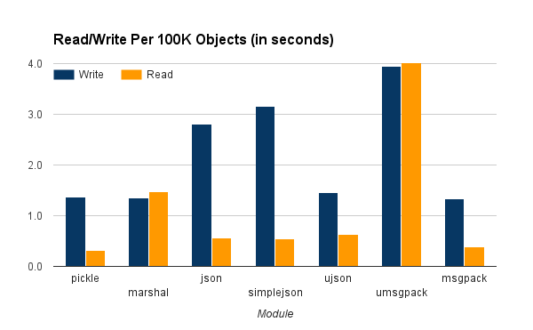
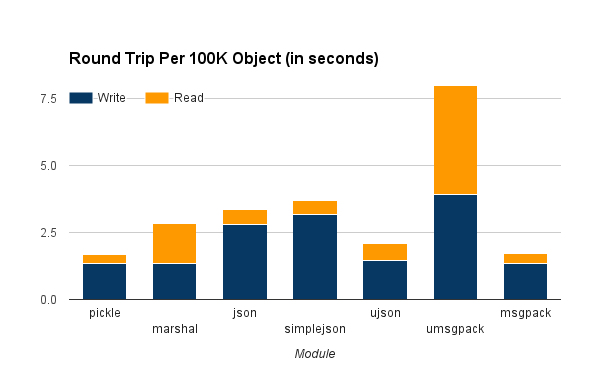

2017-01-06

After measuring [EssentialDB's performance](http://essentialdb.readthedocs.io/en/latest/performance.html), I did some basic profiling and it became very clear that serializing and deserializing objects to disk was the biggest bottleneck and most likely the best opportunity for quick performance boosts. Initial [research](https://www.google.com/search?client=opera&q=fastest+python+serialization&sourceid=opera&ie=UTF-8&oe=UTF-8) suggested that [swapping out pickle](http://www.benfrederickson.com/dont-pickle-your-data/) for a json based library would provide instant performance gains. I was excited - I might cut my write times by [orders of magnitude](https://blog.hartleybrody.com/python-serialize/) with a one line code change! But early experiments simply didn't back [these claims](https://gist.github.com/cactus/4073643). Rather than gaining by orders of magnitude, things got slower. I decided to run some benchmarks of my own and this is what I found.

### What is serialization and deserialization

Basically, you have an object and you want to be able to send across the network or persist it to disk in its current state. To do that, you have to *serialize* the object into a character or byte stream. On the other side, you will need to *deserialize* the character or byte stream into an object with the same state.

### Python (De)Serialization

There are several popular modules available using several different techniques for (de)serialization in Python. For this document, we tested the following:

- [pickle](https://docs.python.org/3/library/pickle.html) - This is the standard for serializing Python objects to disk. Pickle format is *not portable* since it can only be read by Python programs.
- [Marshal](https://docs.python.org/3/library/marshal.html) - This is an internal Python module used for the generation of code objects. The documentation warns strongly against using this for general persistence since it does not ensure compatibility between Python versions. Marshal files are *not portable* since they can only be read by Python programs.
- [json](https://docs.python.org/3/library/json.html) - The standard python module for serializing Python objects to and from JavaScript Object Notation (JSON) representation. Most programming languages can read JSON.
- [simplejson](https://pypi.python.org/pypi/simplejson) - Alternate module for python serialization. Most programming languages can read JSON.
- [ujson](https://pypi.python.org/pypi/ujson) - Alternate module for python serialization backed with a compiled C library. While very fast, the compiled portion makes it difficult to install on some platforms. Most programming languages can read JSON.
- [msgpack](https://pypi.python.org/pypi/msgpack-python/) - Python module for serializing Python objects to and from the very compact [MessagePack](http://msgpack.org/index.html) binary serialization format. This module is backed by a C library for speed. Most programming languages can read MessagePack.
- [umsgpack](https://pypi.python.org/pypi/u-msgpack-python) - Pure python implementation of the MessagePack format.

There are plenty of other formats and modules that I didn't include in these tests for a variety of reasons. For example, tests using [YAML](https://pypi.python.org/pypi/PyYAML/3.12) took so long that my console kept timing out while waiting on them to complete.

### The Tests

I used EssentialDB's fake [document generator](https://github.com/shane-mason/essentialdb/blob/master/tests/document_generator.py) to generate objects with the following template:

    template = {
        "f0": "integer",    #A positive integer
        "f1": "short_int",  #An int between 0 and 100
        "f2": "sentence",   #A string of 3 to 15 words
        "f3": "email",      #An email address
        "f4": "url",        #A website URL
        "f5": "paragraph",  #A string of 3 to 15 sentences
        "f6": "floating",   #A floating point number
        "f7": ['one', 'two', 'three', 'four'] #One of the 4 choices
    }

- Generate 100,000 objects (dictionaries)
- For each of the modules
    - Start the write timer
    - For 1 to 10
        - serialize the objects to disk
    - Stop the write timer
    - Start the read timer
    - For 1 to 10
        - deserialize the objects from disk
    - Stop the read timer

You can find the [full source code here](https://gist.github.com/shane-mason/8bbe965fd7cd1b8ff94c098d4be63435).

The tests were ran on an Amazon AWS t2.small running stock Ubuntu with Python 3.5.

### The Results

The following figure show the average of 10 reads/writes of 100K objects with each (de)serializer. Read and writes are in seconds and size is in megabytes on disk of the serialized objects.

This table shows the raw results.

|Module	   |Write |Read   |Size    |
|----------|------|-------|--------|
|pickle	   |1.362	|0.321	|88.110  |
|marshal	 |1.353	|1.480	|88.050  |
|json	     |2.812	|0.555	|92.287  |
|simplejson|3.166	|0.550	|92.287  |
|ujson	   |1.463	|0.638	|91.127  |
|umsgpack	 |3.940	|4.050	|86.048  |
|msgpack	 |1.342	|0.388	|86.048  |

### What does this mean?

From the data above, we can see that pickle and msg-pack performed the best overall. In my initial research, I read several benchmarks claiming that JSON, particularly ujson, would provide enhanced performance over pickle - but that is not reflected in my test results at all. Why were my results different?

Most of the existing bench marks out there appear to be based on Python2 and these tests were performed on Python3 - which is a very important distinction. Python has two implementations of the pickle module, refered to as cPickle (backed by a C library for speed) and Pickle (a pure Python implementation for portability). In Python2, pickle is loaded by default and required the programmer to use a construct like:

    try:
       import cPickle as pickle
    except:
       import pickle

 In Python3, cPickle was renamed to _pickle and is now automatically loaded when present. If not present, Python will automatically fall back to the pure python implementation. Additionally, Python version 3.0 introduced Protocol 3 and version 3.4 introduced Protocol 4 - both adding significant enhancements and performance boosts to the binary pickle formats.

 The end result of these improvements is that the old best practices for Python serialization don't hold up any more. This is how I will be making my choices:

 - If speed, convenience and flexibility are the most important, choose pickle.
     - Fastest round trip in my test cases
     - Python built-in, so `import pickle` just works
     - Most Python object support it already, so they automatically (de)serialize
 - If speed and portability are the most important, choose msg-pack
     - Second fastest round trip in my tests cases
     - Serial format has support in over 50 programming language
     - But requires a C-Module, so you might need a compiler if you can't find a binary release for your platform
 - If speed and JSON format are the most important, use ujson
     - Third fastest round trip
     - Outputs compliant JSON, which has become the de-facto exchange format
     - But requires a C-Module, so you might need a compiler if you can't find a binary release for your platform
 - If convenience and JSON format are the most important factors, use the built-in json module.
     - Fourth fastest round trip time
     - Outputs compliant JSON, which has become the de-facto exchange format
     - Python built-in, so `import json` just works

### For the EssentialDB Use Case

EssentialDB doesn't support any partitioning or sharding currently (since it is generally meant to be used in memory) so the entire database is serialized and deserialized to disk at once - so speed (throughput) is the most important factor in many use cases. Many, but not all cases. Based on this, it makes sense that EssentialDB should support all of the serialization modules listed above. There are valid use cases to prefer any of the formats. Each of the module discussed here implement the same Python serialization interface:

    # read - fp is a file object
    data = serializer.load(fp)
    #write
    serializer.dump(fp, data)

By exploiting this, we can have pickle be the default serializer, but allow developers to specify alternate serializers.

The [pickle documentation ](https://docs.python.org/3/library/pickle.html) has a great discussion on when the differences in the formats:

   - JSON is a text serialization format (it outputs unicode text, although most of the time it is then encoded to utf-8), while pickle is a binary serialization format;
   - JSON is human-readable, while pickle is not;
   - JSON is interoperable and widely used outside of the Python ecosystem, while pickle is Python-specific;
   - JSON, by default, can only represent a subset of the Python built-in types, and no custom classes; pickle can represent an extremely large number of Python types (many of them automatically, by clever usage of Python’s introspection facilities; complex cases can be tackled by implementing specific object APIs).
